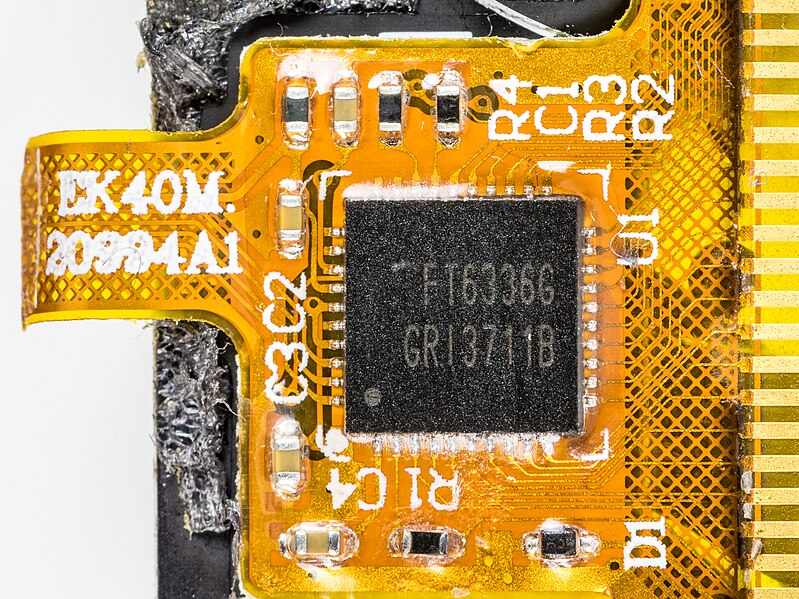

# Obsidian 圖片連結格式範例

這是一個示範如何在 Obsidian 中使用不同圖片連結格式的範例文件。

## 1. Wiki 連結格式（Obsidian 原生）

這是 Obsidian 最常用的內嵌圖片語法：

```
![[image.jpg]]
```

實際範例：
![[hadimg_hid_i2c_1.jpg]]

## 2. Markdown 格式（GitHub 相容）

這是 GitHub 和大多數 Markdown 編輯器支援的格式：

```markdown

```

實際範例：


## 3. 絕對路徑格式

使用完整路徑連結圖片：

```markdown

```

## 4. 外部 URL 連結

連結到網路上的圖片：

```markdown

```

---

## 轉換說明

如果你需要將 Wiki 連結格式 `![[image.jpg]]` 轉換為 Markdown 格式 ``，可以使用以下工具：

1. **Image Link Converter** 插件
2. **Link Converter** 插件
3. 手動使用搜尋取代功能

> **注意**：轉換時記得也要更新圖片路徑，確保相對路徑正確。